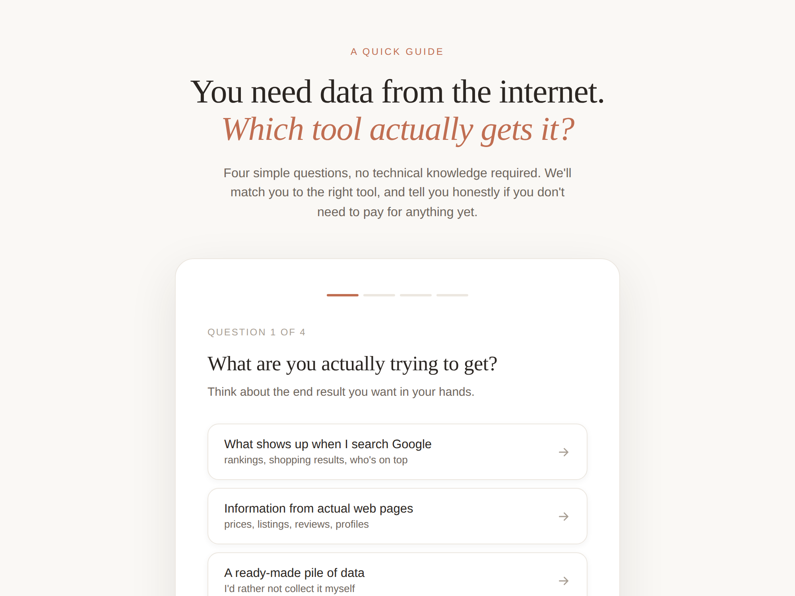

# Which Web Scraping Tool Do You Need?

An interactive guide that matches you to the right web data tool in four simple questions. No technical knowledge required.

**[▶ Try it live](https://sanbhaumik.github.io/which-web-scraping-tool)**



## What this is

There are a lot of web data tools, and it's genuinely hard to tell which one your problem needs. Reach too high and you overpay for a browser when a simple request would do. Reach too low and your scraper dies the moment it hits a login wall.

This tool asks four plain-language questions about what you're trying to get, then points you to the tool that fits, from search results all the way up to a full browsing agent. If the honest answer is that you don't need to pay for anything yet, it tells you that too.

## How it works

Answer four questions:

1. What are you actually trying to get?
2. Do you have to click around to reach it?
3. Is it a well-known site, or something niche?
4. Is the site putting up a fight?

Based on your answers, you're matched to one of eight outcomes, each with a plain-English explanation, a real-world example, and an honest note on why the other tools would be overkill.

## The tools it covers

| Tool | Best for |
|------|----------|
| Proxy Network | Building your own collector and needing reliable global connections |
| SERP API | Getting search engine results as structured data |
| Web Unlocker | Fetching a single page past bot defences |
| Scraper API | Pulling data from well-known sites at scale |
| Scraper Studio | Building a self-healing collector for a niche site, no code |
| Agent Browser | Reaching data behind logins and multi-step navigation |
| Datasets | Buying ready-made data instead of collecting it |

## Running it locally

It's a single HTML file with no build step and no dependencies. Clone the repo and open `index.html` in any browser:

```
git clone https://github.com/sanbhaumik/which-web-scraping-tool.git
cd which-web-scraping-tool
open index.html
```

## Built with

Plain HTML, CSS, and JavaScript. No frameworks, no build tools. Fonts are Fraunces and DM Sans via Google Fonts.

## About

Built by [Sandi Bhaumik](https://linkedin.com/in/sandipanbhaumik), who writes about production AI and the gap between demos and real deployment. The tool maps your need to the relevant [Bright Data](https://brightdata.com) product.

*Contains affiliate links. Recommendations are based on what your problem actually needs, not on commission.*

## Licence

MIT. See [LICENSE](LICENSE).
